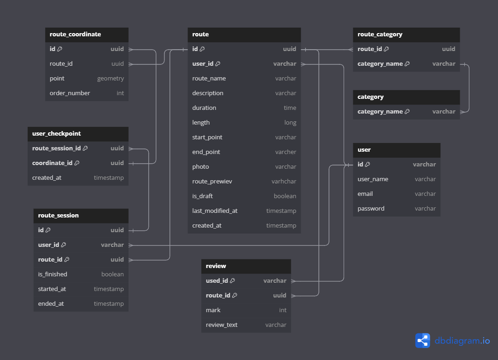

# Архитекрута базы данных

[Ссылка на редактор](https://dbdiagram.io/d/walking-routes-app-db-6720d4efb4216d5a28982ef5)

## Описание базы данных

### Таблица `user`
Содержит информацию о пользователях приложения.

| Поле       | Тип данных | Ключ          | Описание                                   |
|------------|------------|---------------|--------------------------------------------|
| id         | varchar    | Primary Key   | Уникальный идентификатор пользователя      |
| user_name  | varchar    |               | Имя пользователя                           |
| email      | varchar    |               | Электронная почта пользователя             |
| password   | varchar    |               | Пароль пользователя                        |

### Таблица `route`
Содержит информацию о маршрутах, которые создаются пользователями.

| Поле            | Тип данных | Ключ            | Описание                                   |
|-----------------|------------|-----------------|--------------------------------------------|
| id              | uuid       | Primary Key     | Уникальный идентификатор маршрута          |
| user_id         | varchar    | Primary Key, FK | Идентификатор пользователя, создавшего маршрут |
| route_name      | varchar    |                 | Название маршрута                          |
| description     | varchar    |                 | Описание маршрута                          |
| duration        | time       |                 | Длительность маршрута                      |
| length          | long       |                 | Протяженность маршрута                     |
| start_point     | varchar    |                 | Начальная точка маршрута                   |
| end_point       | varchar    |                 | Конечная точка маршрута                    |
| photo           | varchar    |                 | Фото для превью маршрута                   |
| route_preview   | varchar    |                 | Превью маршрута ???                        |
| is_draft        | boolean    |                 | Черновик маршрута                          |
| last_modified_at| timestamp  |                 | Дата последнего изменения                  |
| created_at      | timestamp  |                 | Дата создания маршрута                     |

### Таблица `category`
Хранит категории маршрутов.

| Поле           | Тип данных | Ключ        | Описание                                   |
|----------------|------------|-------------|--------------------------------------------|
| category_name  | varchar    | Primary Key | Название категории маршрута                |

### Таблица `route_category`
Связующая таблица для маршрутов и категорий. Позволяет маршруту иметь несколько категорий.

| Поле           | Тип данных | Ключ            | Описание                                   |
|----------------|------------|-----------------|--------------------------------------------|
| route_id       | uuid       | Primary Key, FK | Идентификатор маршрута                     |
| category_name  | varchar    | Primary Key, FK | Название категории маршрута                |

### Таблица `route_coordinate`
Содержит координаты, определяющие маршрут. Каждая координата имеет порядок, указывающий на ее позицию в маршруте.

| Поле          | Тип данных | Ключ        | Описание                                   |
|---------------|------------|-------------|--------------------------------------------|
| id            | uuid       | Primary Key | Уникальный идентификатор координаты        |
| route_id      | uuid       | FK          | Идентификатор маршрута                     |
| point         | geometry   |             | Геометрическая точка маршрута              |
| order_number  | int        |             | Порядковый номер точки в маршруте          |

### Таблица `route_session`
Хранит информацию о прохождении маршрута пользователем, включая статус завершения и время начала/окончания.

| Поле          | Тип данных | Ключ            | Описание                                   |
|---------------|------------|-----------------|--------------------------------------------|
| id            | uuid       | Primary Key     | Уникальный идентификатор сессии            |
| user_id       | varchar    | Primary Key, FK | Идентификатор пользователя                 |
| route_id      | uuid       | Primary Key, FK | Идентификатор маршрута                     |
| is_finished   | boolean    |                 | Флаг завершенности маршрута                |
| started_at    | timestamp  |                 | Время начала прохождения маршрута          |
| ended_at      | timestamp  |                 | Время окончания прохождения маршрута       |

### Таблица `user_checkpoint`
Содержит точки маршрута, пройденные пользователем в рамках его сессии. Используется для отслеживания прогресса.

| Поле             | Тип данных | Ключ            | Описание                                   |
|------------------|------------|-----------------|--------------------------------------------|
| route_session_id | uuid       | Primary Key, FK | Идентификатор сессии маршрута              |
| coordinate_id    | uuid       | Primary Key, FK | Идентификатор координаты маршрута          |
| created_at       | timestamp  |                 | Время создания точки прохождения           |

### Таблица `review`
Хранит отзывы пользователей о маршрутах, включая оценку и текстовый комментарий.

| Поле          | Тип данных | Ключ            | Описание                                   |
|---------------|------------|-----------------|--------------------------------------------|
| user_id       | varchar    | Primary Key, FK | Идентификатор пользователя                 |
| route_id      | uuid       | Primary Key, FK | Идентификатор маршрута                     |
| mark          | int        |                 | Оценка маршрута                            |
| review_text   | varchar    |                 | Текст отзыва                               |

